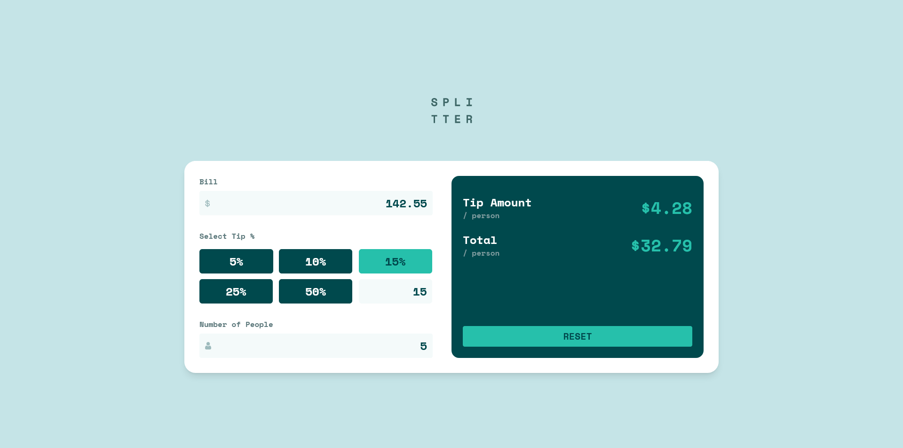
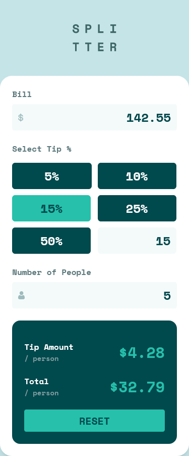

# Frontend Mentor - Tip calculator app solution

This is a solution to the [Tip calculator app challenge on Frontend Mentor](https://www.frontendmentor.io/challenges/tip-calculator-app-ugJNGbJUX). Frontend Mentor challenges help you improve your coding skills by building realistic projects.

## Table of contents

- [Overview](#overview)
  - [The challenge](#the-challenge)
  - [Screenshots](#screenshots)
  - [Links](#links)
- [My process](#my-process)
  - [Built with](#built-with)
  - [What I learned](#what-i-learned)
  - [Continued development](#continued-development)
  - [Useful resources](#useful-resources)
- [Author](#author)

## Overview

### The challenge

Users should be able to:

- View the optimal layout for the app depending on their device's screen size
- See hover states for all interactive elements on the page
- Calculate the correct tip and total cost of the bill per person

### Screenshots

### Links

- Solution URL: [GitHub](https://github.com/Yazeed-Idris/tip-calculator-app)
- Live Site URL: [GitHub Pages](https://yazeed-idris.github.io/tip-calculator-app/)

## My process

### Built with

- [Vue 3](https://v3.vuejs.org/)
- [Vite](https://vitejs.dev/)
- [TailwindCSS](https://tailwindcss.com/)
- [gh-pages](https://www.npmjs.com/package/gh-pages)

### What I learned

This is my first Vue project, and it was tricky towards the end because of the way Vue checks for props changes. However, I was able to fix my mistakes and complete the challenge successfully.

### Continued development

The project works fine now. But it could use some animations and transitions. I will add them in the future.

### Useful resources

- [Vue 3 Docs](https://v3.vuejs.org/) - This helped me understand the basics of Vue 3.
- [Stack Overflow](https://stackoverflow.com/) - This site is the first place I look for answers about a problem I'm
  facing.
- [TailwindCSS Docs](https://tailwindcss.com/docs) - This has all the classes I used in the projects.

## Author

- Github - [@Yazeed-Idris](https://github.com/Yazeed-Idris)
- Frontend Mentor - [@Yazeed-Idris](https://www.frontendmentor.io/profile/Yazeed-Idris)
- LinkedIn - [@Yazeed Idris](https://www.linkedin.com/in/yazeed-idris/)
